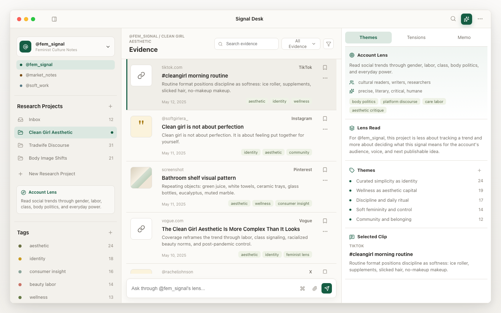

# Lensdesk

Lensdesk is an evidence-first desktop workspace for social media research and multi-account content strategy.

It is designed for creators, researchers, and brand strategists who collect social media posts, comments, screenshots, links, and field notes, then interpret those materials through different account lenses.



## Why Lensdesk

Most AI chat apps start from a blank prompt. Lensdesk starts from evidence.

The core idea is simple:

- Each account has a distinct lens: audience, tone, stance, content pillars, and boundaries.
- Each research project gathers evidence from social platforms and cultural signals.
- AI-assisted analysis should explain what the evidence means for a specific account, not produce generic summaries.

## Current Prototype

This early prototype includes:

- Multi-account lens switching
- Research projects per account
- Evidence stream for links, quotes, screenshots, and notes
- Account Lens panel with audience, tone, and content pillars
- Themes, tensions, memo notes, and selected clip inspection
- Context-aware composer: ask through the current account lens

## Product Direction

Lensdesk is not trying to be a generic chatbot or a full enterprise social listening dashboard.

It is a personal research desk for turning social media fragments into:

- cultural observations
- audience insights
- content angles
- research memos
- account-specific strategy

## Tech Stack

- React
- TypeScript
- Vite
- Lucide icons
- Oxlint

## Development

Install dependencies:

```bash
npm install
```

Start the dev server:

```bash
npm run dev
```

Build:

```bash
npm run build
```

Lint:

```bash
npm run lint
```

## Roadmap

- Add local persistence for accounts, projects, evidence, and notes
- Add material capture flow for links, text, and screenshots
- Add AI analysis templates for culture research, market research, and content strategy
- Add memo editor with source-linked citations
- Package as a Mac desktop app with Tauri

## Status

Lensdesk is an early product prototype. The current focus is interaction design, information architecture, and validating whether account-based lenses make social media research easier to act on.
